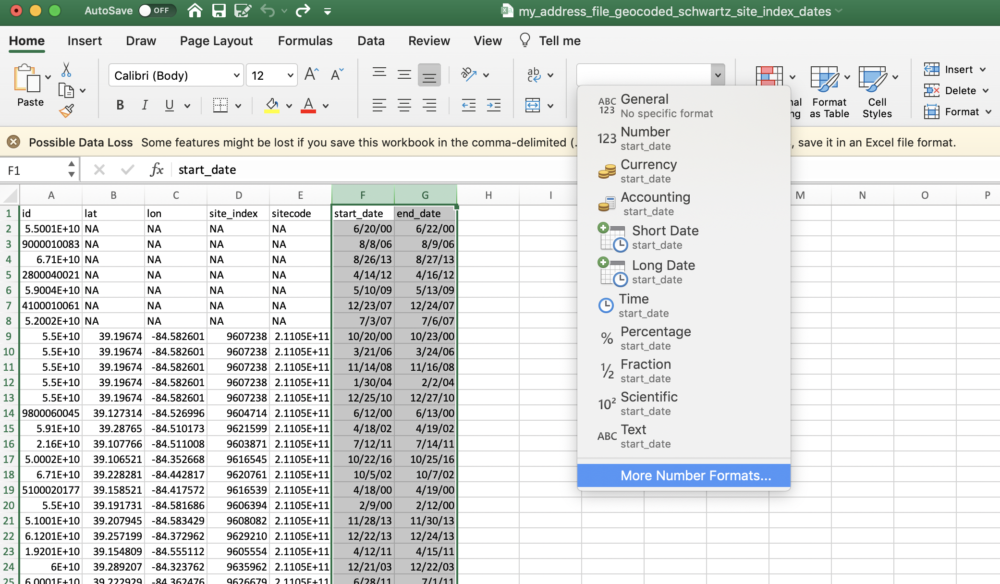

# schwartz <a href='https://degauss-org.github.io/DeGAUSS/'></a>

> add PM2.5, NO2, and O3 concentrations from Schwartz Model to data

[](https://hub.docker.com/repository/docker/degauss/schwartz/tags)
[](https://github.com/degauss-org/schwartz/releases)

## DeGAUSS example call

If `my_address_file_geocoded_schwartz_site_index_dates.csv` (output from the [`schwartz_grid_lookup`](https://degauss.org/schwartz_grid_lookup/) container) is a file in the current working directory with columns named `sitecode`, `start_date` and `end_date`, and `aws_key` and `aws_secret_key` are provided AWS credentials, then

```sh
docker run --rm -v "$PWD":/tmp degauss/schwartz:0.1 my_address_file_geocoded_schwartz_site_index_dates.csv aws_key aws_secret_key
```

will produce `my_address_file_geocoded_schwartz_site_index_dates_schwartz.csv` with added columns named `PM25`, `NO2`, and `O3`.

## Excel warning

Opening the input CSV file in Microsoft Excel can change column formats resulting in incorrect pollution estimates from the `schwartz` container. If opening the CSV in Excel before feeding it to the container cannot be avoided, please follow the guidelines below for ensuring columns are formatted properly.

**1. `start_date` and `end_date`**

Excel autoformats dates, usually as `MM/DD/YY`, regardless of the format in which the user supplied the date. Further, Excel will *display* a date in that format even if the actual *value* is stored in a different format. 

The `schwartz` container works best when dates are formatted as `YYYY-MM-DD`. You can change this format manually in Excel.

Highlight your date columns and select "More Number Formats". Then, under **Date** formatting, select the `YYYY-MM-DD` format and click OK. 

{ width=45% }  { width=45% }

**2. `sitecode`**

Because the sitecode is a large number (12 digits), Excel will often display it in scientific notation. If the sitecode does not remain formatted as a number, some digits could be stored as zeros, changing the sitecode to a different sitecode (this will result in pollutant data from the wrong geographic location). 

Similar to formatting the dates, you can format the sitecode as a number. 

{ width=50% }

**NOTE**: Excel's display will probably not show these changes if the file is saved, closed, and re-opened. One way to see the actual values of the csv file, is to open with a simple text editor, like notepad or TextEdit. 

{ width=45% }  { width=45% }

## geomarker methods

Details on methods can be found at [https://github.com/geomarker-io/schwartz_exposure_assessment](https://github.com/geomarker-io/schwartz_exposure_assessment)

## geomarker data

- Schwartz pollutant data is stored as [qs](https://github.com/traversc/qs) files in a private S3 bucket, which can only be accessed with appropriate AWS credentials. 

- Files are named with 3-digit geohash (or a combination of 3-digit geohashes in areas where population is sparse) and year of pollutant data. For example,  [`s3://geomarker/schwartz/exp_estimates_1km/by_gh3_year/dng_2016_round1.qs`](https://geomarker.s3.us-east-2.amazonaws.com/geomarker/schwartz/exp_estimates_1km/by_gh3_year/dng_2016_round1.qs)

## DeGAUSS details

For detailed documentation on DeGAUSS, including general usage and installation, please see the [DeGAUSS homepage](https://degauss.org).

